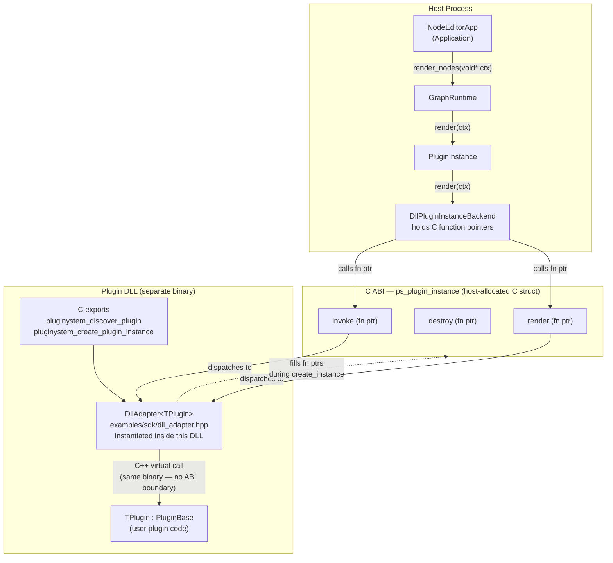
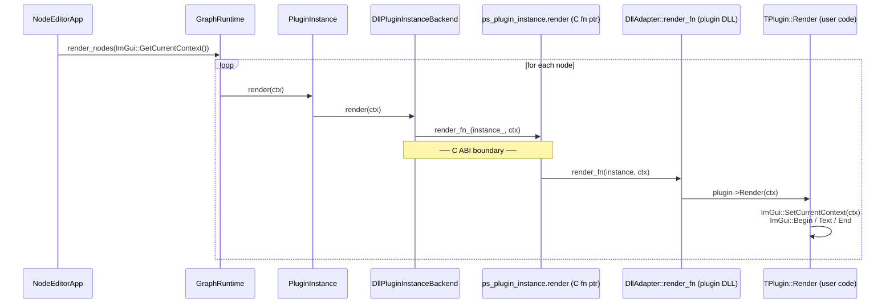

# PluginSystem Architecture

## Component Overview

> `DllAdapter` is a header-only template compiled **into the plugin DLL** via `PLUGINSYSTEM_EXPORT_PLUGIN`.
> C++ calls such as `plugin->HasRender()` or `plugin->Render()` never cross a binary boundary —
> they are ordinary virtual calls within the same `.dll`.
> The host only ever touches the `ps_plugin_instance` C function pointers, which is the true stable boundary.

---

## Render Call Flow

---

## System Boundary

PluginSystem is a reusable C++ runtime library for node-editor style pipelines. It provides runtime primitives: plugin provider registration, discovery, instance creation, shared-memory ports, shared-memory properties, and entrypoint invocation.

The consuming application owns blueprint editing, graph scheduling, IPC, process placement, persistence, and visual node-editor behavior. PluginSystem can be used inside multiple processes; each process creates the plugin instances it needs and maps shared-memory ports/properties by name.

## Provider Model

All plugins come from a `PluginProvider`.

- A DLL provider discovers and creates plugins from dynamic libraries.
- A built-in provider exposes plugins compiled into the host application or the PluginSystem library.
- Applications can register their own providers.

Every provider returns the same `PluginDescriptor` shape and creates `PluginInstance` backends through the same runtime path. Code using `PluginRegistry` does not need to know whether a plugin came from a DLL or source code.

## Discovery

Discovery happens before instance creation. A descriptor includes:

- plugin id, name, version, description
- entrypoints
- ports
- runtime properties
- raw property block size
- concurrency policy

Discovery is side-effect-light. It must not allocate ports, create properties, or start pipeline work.

## Instance Lifecycle

An instance is created from a descriptor plus fixed bindings:

- blueprint name
- instance name
- host-created port shared memory
- host-created property shared memory

Bindings are immutable in v1. Rewiring requires destroying and recreating the affected instance or rebuilding the blueprint.

For DLL plugins, each instance loads a copied DLL path. This allows multiple instances of the same source DLL to have separate loader handles. For built-in plugins, instances are created directly from registered factories.

## Entrypoints

Plugins expose named entrypoints. Each entrypoint can read/write bound ports and properties through the invocation context. Calls may be synchronous or submitted as async jobs.

Entrypoints are the trigger surface for node-editor execution. Ports are the data surface.

## Concurrency

Plugins may be triggered concurrently from different threads in the same process. The descriptor declares a concurrency policy:

- `instance_serialized`: one active call per instance
- `entrypoint_serialized`: calls to the same entrypoint are serialized
- `fully_concurrent`: PluginSystem does not serialize calls

The host enforces the declared policy. Plugin authors must still protect their own internal state when they declare parallel execution.

## Ports

Ports are created and owned by the host side of PluginSystem, not by plugins.

Each port has:

- id and display name
- input/output direction
- access mode
- byte size and alignment
- type name for application/plugin convention
- readable shared-memory name

The producer side creates the shared-memory object and publishes the name. Readers map the same name. Fan-out uses one shared output object with multiple readers.

## Properties

Runtime properties are host-owned shared memory so they are visible across processes. Host/UI code and plugin code may both read and write properties through PluginSystem APIs.

The property block has two parts:

- typed fixed-size slots for UI-visible properties
- optional raw property block for plugin-defined data

Property writes are synchronized and update a version counter.

